# Desired Architecture: Microservices

This document outlines the plan to evolve the current monolithic backend into a microservices architecture.

## Current State

```mermaid
graph TB
    Client["👤 Client<br/>Mobile/Web"]
    
    subgraph Monolith["📦 estimate-backend - MONOLITH"]
        Auth["🔐 Auth<br/>Register/Login"]
        Works["🔨 Works<br/>CRUD"]
        Templates["📋 Templates<br/>CRUD"]
        Users["👥 Users<br/>Profile"]
        Estimates["💰 Estimates<br/>CRUD"]
        Admin["⚙️ Admin<br/>Operations"]
    end
    
    DB["🗄️ MongoDB<br/>(Single Shared DB)"]
    
    Client -->|All Requests| Monolith
    Monolith -->|Read/Write| DB
    
    style Monolith fill:#ffcccc,stroke:#d32f2f,stroke-width:3px
    style Client fill:#fff9c4,stroke:#f57f17
    style DB fill:#e1f5fe,stroke:#01579b,stroke-width:2px
```



## Target State - Microservices

```mermaid
graph TB
    Client["👤 Client<br/>Mobile/Web"]
    
    subgraph Gateway["🚪 API Gateway<br/>Spring Cloud Gateway"]
        Router["🔀 Router"]
        AuthFilter["🔒 Auth Filter"]
        RateLimit["⏱️ Rate Limiting"]
    end
    
    subgraph AuthSvc["🔐 Auth Service<br/>auth-service:8081"]
        AuthLogic["Register/Login<br/>Token Management<br/>Validate Tokens"]
        AuthDB["🔑 Firebase/JWT<br/>or MongoDB"]
    end
    
    subgraph WorksSvc["🔨 Works Service<br/>works-service:8082"]
        WorksLogic["CRUD Works<br/>Materials<br/>Material Pricing"]
        WorksDB["🗄️ MongoDB<br/>Works DB"]
    end
    
    subgraph EstSvc["💰 Estimate Service<br/>estimate-service:8083"]
        EstLogic["CRUD Estimates<br/>Templates<br/>Calculations"]
        EstDB["🗄️ MongoDB<br/>Estimates DB"]
    end
    
    subgraph EventBus["📨 Pub/Sub Event Bus<br/>GCP Pub/Sub"]
        Events["Event Streaming"]
    end
    
    Client -->|HTTP/gRPC| Gateway
    Gateway -->|Route| AuthSvc
    Gateway -->|Route| WorksSvc
    Gateway -->|Route| EstSvc
    
    AuthSvc -->|Publish| EventBus
    WorksSvc -->|Publish| EventBus
    EstSvc -->|Publish| EventBus
    
    WorksSvc -->|Read/Write| WorksDB
    AuthSvc -->|Read/Write| AuthDB
    EstSvc -->|Read/Write| EstDB
    
    EstSvc -->|Sync Call| WorksSvc
    
    EventBus -->|Subscribe: UserDeleted| WorksSvc
    EventBus -->|Subscribe: UserDeleted| EstSvc
    EventBus -->|Subscribe: WorkUpdated| EstSvc
    
    style Gateway fill:#4CAF50,stroke:#2e7d32,stroke-width:2px,color:#fff
    style AuthSvc fill:#2196F3,stroke:#1565c0,stroke-width:2px,color:#fff
    style WorksSvc fill:#FF9800,stroke:#e65100,stroke-width:2px,color:#fff
    style EstSvc fill:#9C27B0,stroke:#6a1b9a,stroke-width:2px,color:#fff
    style EventBus fill:#f44336,stroke:#c62828,stroke-width:2px,color:#fff
    style AuthDB fill:#e1f5fe,stroke:#01579b,stroke-width:2px
    style WorksDB fill:#e1f5fe,stroke:#01579b,stroke-width:2px
    style EstDB fill:#e1f5fe,stroke:#01579b,stroke-width:2px
    style Client fill:#fff9c4,stroke:#f57f17
```



## Proposed Microservices

### 1. Auth Service
**Responsibility:** Authentication and user management

```yaml
Service: auth-service
Endpoints:
  - POST /auth/register
  - POST /auth/login
  - POST /auth/refresh
  - GET /auth/validate
  - GET /users/me
  - PUT /users/me
  - DELETE /users/me
Database: Firebase (GCP) or MongoDB (JWT)
```

**Bounded Context:** Identity & Access

### 2. Works Service  
**Responsibility:** Manage construction works and materials

```yaml
Service: works-service
Endpoints:
  - GET /works
  - POST /works
  - GET /works/{id}
  - PUT /works/{id}
  - DELETE /works/{id}
Database: MongoDB (works collection)
```

**Bounded Context:** Work Catalog

### 3. Estimate Service
**Responsibility:** Cost estimates and templates

```yaml
Service: estimate-service
Endpoints:
  - GET /templates
  - POST /templates
  - GET /estimates
  - POST /estimates
  - PUT /estimates/{id}
  - DELETE /estimates/{id}
  - GET /estimates/{id}/calculate
Database: MongoDB (templates, estimates collections)
```

**Bounded Context:** Estimation

### 4. API Gateway
**Responsibility:** Routing, auth validation, rate limiting

```yaml
Service: api-gateway
Technology: Spring Cloud Gateway or GCP API Gateway
Features:
  - Route requests to services
  - Validate JWT/Firebase tokens
  - Rate limiting
  - CORS handling
  - Request logging
```

## Service Communication Patterns

### Communication Flow

```mermaid
graph LR
    Auth["🔐 Auth Service"]
    Works["🔨 Works Service"]
    Est["💰 Estimate Service"]
    PubSub["📨 Pub/Sub"]
    
    Auth -->|1. Sync: Validate Token| Works
    Auth -->|1. Sync: Validate Token| Est
    
    Est -->|2. Sync: Get Work Details| Works
    
    Auth -->|3. Publish: UserDeleted| PubSub
    Works -->|4. Publish: WorkUpdated| PubSub
    Est -->|5. Publish: EstimateCreated| PubSub
    
    PubSub -->|Subscribe| Works
    PubSub -->|Subscribe| Est
    
    style Auth fill:#2196F3,stroke:#1565c0,stroke-width:2px,color:#fff
    style Works fill:#FF9800,stroke:#e65100,stroke-width:2px,color:#fff
    style Est fill:#9C27B0,stroke:#6a1b9a,stroke-width:2px,color:#fff
    style PubSub fill:#f44336,stroke:#c62828,stroke-width:2px,color:#fff
```



### Synchronous (HTTP/gRPC)
- **Gateway → Services**: Route and authenticate requests
- **Estimate Service → Works Service**: Get work details for estimate calculation (low latency, critical path)

### Asynchronous (Pub/Sub Events)
- **Auth Service → All Services**: `UserDeleted` - Cascade delete user data
- **Works Service → Estimate Service**: `WorkUpdated`, `WorkDeleted` - Invalidate calculations
- **Estimate Service**: `EstimateCreated`, `EstimateUpdated` - Audit/logging

## Data Management

### Database per Service
Each service owns its data:

| Service | Database | Collections |
|---------|----------|-------------|
| Auth | Firebase/MongoDB | users |
| Works | MongoDB | works |
| Estimate | MongoDB | templates, estimates |

### Data Consistency
- Eventual consistency via events
- Saga pattern for cross-service transactions
- Each service maintains denormalized data it needs

### Example: Creating Estimate
```
1. Client → Gateway → Estimate Service: Create estimate
2. Estimate Service → Works Service: Get work details (sync)
3. Estimate Service: Calculate totals
4. Estimate Service → MongoDB: Save estimate
5. Estimate Service → Pub/Sub: EstimateCreated event
```

## Migration Strategy

### Timeline Overview

```mermaid
graph LR
    P0["📦 Phase 0<br/>CURRENT<br/>Monolith"]
    P1["🔐 Phase 1<br/>Week 1-2<br/>Extract Auth"]
    P2["🔨 Phase 2<br/>Week 3-4<br/>Extract Works"]
    P3["💰 Phase 3<br/>Week 5<br/>Extract Est"]
    P4["⚡ Phase 4<br/>Week 6<br/>Optimize"]
    
    P0 -->|Extract & Setup Gateway| P1
    P1 -->|Extract & Add Events| P2
    P2 -->|Extract & Complete| P3
    P3 -->|Monitor & Optimize| P4
    
    style P0 fill:#ffcccc,stroke:#d32f2f,stroke-width:3px
    style P1 fill:#fff9c4,stroke:#f57f17,stroke-width:2px
    style P2 fill:#fff9c4,stroke:#f57f17,stroke-width:2px
    style P3 fill:#e1f5fe,stroke:#01579b,stroke-width:2px
    style P4 fill:#c8e6c9,stroke:#2e7d32,stroke-width:2px
```



### Phase 1: Extract Auth Service (2 weeks)

**Objectives:** Separate authentication from business logic

```mermaid
graph TB
    subgraph Current["BEFORE: Monolith"]
        Mono["📦 estimate-backend<br/>Auth + Works<br/>+ Templates<br/>+ Estimates<br/>+ Admin"]
        MonoDB["🗄️ MongoDB"]
    end
    
    subgraph After["AFTER: Auth Extracted"]
        Gateway["🚪 API Gateway<br/>Routes & Auth"]
        Auth["🔐 Auth Service<br/>JWT/Firebase<br/>Token Management"]
        Mono2["📦 estimate-backend<br/>Works + Templates<br/>+ Estimates + Admin"]
        AuthDB["🗄️ Auth DB"]
        MonoDB2["🗄️ MongoDB"]
    end
    
    Current -->|"Extract<br/>Auth Logic"| After
    Mono --> MonoDB
    Gateway --> Auth
    Gateway --> Mono2
    Auth --> AuthDB
    Mono2 --> MonoDB2
    
    style Current fill:#ffcccc,stroke:#d32f2f,stroke-width:3px
    style After fill:#fff9c4,stroke:#f57f17,stroke-width:2px
    style Gateway fill:#4CAF50,stroke:#2e7d32,stroke-width:2px,color:#fff
    style Auth fill:#2196F3,stroke:#1565c0,stroke-width:2px,color:#fff
```



**Tasks:**
1. ✅ Create auth-service repository
2. ✅ Move authentication code from monolith
3. ✅ Implement API Gateway for routing
4. ✅ Set up JWT/Firebase in service
5. ✅ Deploy to Cloud Run
6. ✅ Update monolith to use gateway
7. ✅ Comprehensive testing

### Phase 2: Extract Works Service (2 weeks)

**Objectives:** Separate work catalog from estimates

```mermaid
graph TB
    subgraph Before["BEFORE: Phase 1"]
        Gateway1["🚪 API Gateway"]
        Auth1["🔐 Auth Service"]
        Mono1["📦 estimate-backend<br/>Works + Templates<br/>+ Estimates + Admin"]
    end
    
    subgraph After["AFTER: Works Extracted"]
        Gateway2["🚪 API Gateway"]
        Auth2["🔐 Auth Service"]
        Works["🔨 Works Service<br/>CRUD Works<br/>Materials"]
        Mono2["📦 estimate-backend<br/>Templates + Estimates<br/>+ Admin"]
        PubSub["📨 Pub/Sub Events"]
        WorksDB["🗄️ Works DB"]
        EstDB["🗄️ Est DB"]
    end
    
    Before -->|"Extract<br/>Works & Add Events"| After
    
    Gateway2 --> Auth2
    Gateway2 --> Works
    Gateway2 --> Mono2
    
    Works -->|Read/Write| WorksDB
    Mono2 -->|Read/Write| EstDB
    
    Mono2 -->|"Sync Calls<br/>Get Work Details"| Works
    Works -->|"Publish:<br/>WorkUpdated"| PubSub
    Mono2 -->|"Subscribe"| PubSub
    
    style Before fill:#fff9c4,stroke:#f57f17,stroke-width:2px
    style After fill:#f0f4c3,stroke:#f57f17,stroke-width:2px
    style Works fill:#FF9800,stroke:#e65100,stroke-width:2px,color:#fff
    style PubSub fill:#f44336,stroke:#c62828,stroke-width:2px,color:#fff
```



**Tasks:**
1. ✅ Create works-service repository
2. ✅ Extract works management code
3. ✅ Implement inter-service communication (HTTP sync calls)
4. ✅ Set up Pub/Sub for events
5. ✅ Deploy to Cloud Run
6. ✅ Implement caching for performance
7. ✅ Comprehensive testing & validation

### Phase 3: Finalize Estimate Service (1 week)

**Objectives:** Complete microservices architecture

```mermaid
graph TB
    subgraph Final["✅ FINAL: Microservices Architecture"]
        Client["👤 Clients"]
        
        Gateway["🚪 API Gateway<br/>Spring Cloud Gateway<br/>Rate Limit & Auth"]
        
        Auth["🔐 Auth Service:8081<br/>Register/Login<br/>Token Management"]
        Works["🔨 Works Service:8082<br/>Works CRUD<br/>Materials"]
        Est["💰 Estimate Service:8083<br/>Estimates CRUD<br/>Templates<br/>Calculations"]
        
        PubSub["📨 Pub/Sub<br/>Event Bus"]
        
        AuthDB["🔑 Auth DB"]
        WorksDB["🗄️ Works DB"]
        EstDB["🗄️ Est DB"]
        
        Client --> Gateway
        
        Gateway --> Auth
        Gateway --> Works
        Gateway --> Est
        
        Auth --> AuthDB
        Works --> WorksDB
        Est --> EstDB
        
        Est -->|"GET /works/x<br/>Sync Calls"| Works
        
        Auth -->|"UserDeleted"| PubSub
        Works -->|"WorkUpdated"| PubSub
        Est -->|"EstimateCreated"| PubSub
        
        PubSub -->|"Subscribe"| Auth
        PubSub -->|"Subscribe"| Works
        PubSub -->|"Subscribe"| Est
    end
    
    style Gateway fill:#4CAF50,stroke:#2e7d32,stroke-width:2px,color:#fff
    style Auth fill:#2196F3,stroke:#1565c0,stroke-width:2px,color:#fff
    style Works fill:#FF9800,stroke:#e65100,stroke-width:2px,color:#fff
    style Est fill:#9C27B0,stroke:#6a1b9a,stroke-width:2px,color:#fff
    style PubSub fill:#f44336,stroke:#c62828,stroke-width:2px,color:#fff
    style AuthDB fill:#e1f5fe,stroke:#01579b,stroke-width:2px
    style WorksDB fill:#e1f5fe,stroke:#01579b,stroke-width:2px
    style EstDB fill:#e1f5fe,stroke:#01579b,stroke-width:2px
    style Client fill:#fff9c4,stroke:#f57f17,stroke-width:2px
```



**Tasks:**
1. ✅ Create estimate-service repository
2. ✅ Extract remaining estimate/template logic
3. ✅ Complete Pub/Sub event streaming
4. ✅ Implement saga pattern for data consistency
5. ✅ Deploy all services to Cloud Run
6. ✅ Comprehensive integration testing
7. ✅ Monitor and validate in production

### Phase 4: Optimization (1 week)

**Objectives:** Performance tuning, monitoring, documentation

**Tasks:**
1. ✅ Performance profiling & optimization
2. ✅ Load testing between services
3. ✅ Distributed tracing setup
4. ✅ Alert thresholds & dashboards
5. ✅ Auto-scaling policies
6. ✅ Documentation update
7. ✅ Team training

## Technology Stack

### Per Service
- Java 21 / Spring Boot 3.4 / WebFlux
- Docker container
- Cloud Run deployment
- Individual MongoDB database

### Shared Infrastructure
- GCP API Gateway or Spring Cloud Gateway
- GCP Pub/Sub for events
- Cloud Logging / Monitoring
- Secret Manager for credentials

### Observability
- Distributed tracing (Cloud Trace)
- Centralized logging
- Health checks per service
- Metrics and alerting

## Repository Structure

### Option A: Monorepo
```
estimate-platform/
├── services/
│   ├── auth-service/
│   ├── works-service/
│   ├── estimate-service/
│   └── api-gateway/
├── shared/
│   ├── common-models/
│   └── common-utils/
└── infrastructure/
    ├── terraform/
    └── kubernetes/
```

### Option B: Multi-repo (Recommended)
```
Repositories:
  - estimate-auth-service
  - estimate-works-service  
  - estimate-estimate-service
  - estimate-api-gateway
  - estimate-shared-lib
  - estimate-infrastructure
```

## API Versioning

```
/api/v1/works
/api/v2/works  (future)
```

Gateway routes to appropriate service version.

## Security

### Service-to-Service Authentication
- Internal JWT tokens
- Service accounts in GCP
- mTLS for sensitive services

### External Authentication
- Gateway validates all external tokens
- Services trust gateway headers
- User context propagated via headers

## Cost Estimation

### Cloud Run (per service)
- Min instances: 0 (scale to zero)
- Max instances: 10
- Memory: 512MB - 1GB
- CPU: 1 vCPU

### MongoDB Atlas
- Shared cluster for dev
- Dedicated cluster for prod
- Per-service databases

### Estimated Monthly Cost (GCP)
| Resource | Dev | Prod |
|----------|-----|------|
| Cloud Run (4 services) | $20 | $100 |
| MongoDB Atlas | Free | $50 |
| Pub/Sub | $1 | $10 |
| API Gateway | $5 | $20 |
| **Total** | **~$26** | **~$180** |

## Success Criteria

- [ ] Each service deployable independently
- [ ] No shared database between services
- [ ] Circuit breakers for service calls
- [ ] Graceful degradation
- [ ] Zero-downtime deployments
- [ ] Horizontal scaling capability
- [ ] Centralized logging and tracing
- [ ] <100ms latency for 95% of requests

## Timeline

| Phase | Duration | Deliverables |
|-------|----------|--------------|
| 1. Auth Service | 2 weeks | Extracted auth, gateway |
| 2. Works Service | 2 weeks | Extracted works, events |
| 3. Estimate Service | 1 week | Finalized architecture |
| 4. Optimization | 1 week | Performance, monitoring |
| **Total** | **6 weeks** | Full microservices |

## Risks & Mitigations

| Risk | Mitigation |
|------|------------|
| Increased complexity | Start with 3 services only |
| Network latency | Cache frequently used data |
| Data consistency | Use saga pattern, eventual consistency |
| Debugging difficulty | Invest in observability |
| Cost increase | Use scale-to-zero, shared resources |

## Decision Log

| Date | Decision | Rationale |
|------|----------|-----------|
| TBD | Multi-repo vs monorepo | TBD after team discussion |
| TBD | gRPC vs REST | TBD based on performance needs |
| TBD | Shared DB vs per-service | Per-service for true isolation |

---

**Status:** Proposal  
**Next Step:** Team review and approval
