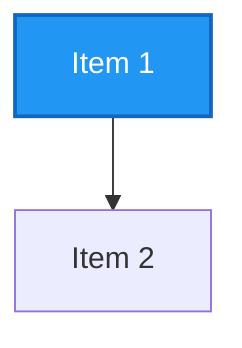

# 🎨 Visual Documentation - Mermaid Diagrams Summary

This document catalogs all the visual diagrams added to the project documentation.

## Overview

All diagrams are now rendered with **Mermaid** - a JavaScript-based diagramming and charting tool that renders Markdown-inspired text definitions to create and modify diagrams dynamically.

### Benefits
- ✅ **GitHub Native** - Renders directly in GitHub without external tools
- ✅ **Colorful** - Professional color schemes for different components
- ✅ **Interactive** - Built-in zoom, pan, and download features
- ✅ **Version Controlled** - Diagrams stored as text in git
- ✅ **Maintainable** - Easy to update and evolve

---

## 📄 Documentation Files with Diagrams

### 1. **docs/DESIRED_ARCHITECTURE.md** - Microservices Architecture

#### Diagram 1: Current State - Monolith
- **Type:** Graph/Flowchart
- **Shows:** Single monolithic service with shared MongoDB
- **Color:** Red (⚠️ needs evolution)
- **Use Case:** Understanding starting point

#### Diagram 2: Target State - Microservices
- **Type:** Graph/Flowchart (Complex)
- **Shows:** 
  - API Gateway routing requests
  - Three independent services (Auth, Works, Estimate)
  - Separate databases per service
  - Event bus for async communication
- **Colors:** 
  - 🟢 Gateway (Green)
  - 🔵 Auth Service (Blue)
  - 🟠 Works Service (Orange)
  - 🟣 Estimate Service (Purple)
  - 🔴 Event Bus (Red)
- **Use Case:** Vision of final architecture

#### Diagram 3: Service Communication Patterns
- **Type:** Directed Graph
- **Shows:**
  - Synchronous calls (HTTP/gRPC)
  - Asynchronous events (Pub/Sub)
  - Dependency arrows between services
- **Use Case:** Understanding inter-service communication

#### Diagram 4: Migration Timeline Overview
- **Type:** Linear Timeline
- **Shows:** 4 phases over 6 weeks
- **Color Progression:** Red → Yellow → Yellow → Blue → Green
- **Use Case:** Project planning and phase tracking

#### Diagram 5: Phase 1 - Extract Auth Service
- **Type:** Before/After Comparison
- **Shows:** Monolith to Auth extraction
- **Use Case:** First phase implementation details

#### Diagram 6: Phase 2 - Extract Works Service
- **Type:** Before/After Comparison
- **Shows:** Adding Works service + Pub/Sub
- **Use Case:** Second phase with event integration

#### Diagram 7: Phase 3 - Finalize Microservices
- **Type:** Complete Architecture
- **Shows:** Final state with all services, event bus, databases
- **Color Coded:** Each service has distinct color
- **Use Case:** Final vision confirmation

---

### 2. **docs/authentication.md** - Authentication Architecture

#### Diagram 1: Architecture Layers
- **Type:** Layered Graph
- **Layers:** 
  1. Client (Yellow)
  2. Web Adapter (Yellow)
  3. Application (Blue)
  4. Domain (Purple)
  5. Infrastructure (Blue/Green)
  6. Persistence (Blue/Orange)
- **Shows:** Clean architecture layers from client to database
- **Use Case:** Understanding authentication architecture

#### Diagram 2: Provider Selection
- **Type:** Decision Tree
- **Shows:**
  - Environment variable selection
  - JWT vs GCP profile choice
  - Implementation selection (spring beans)
- **Color:** 
  - JWT (Blue)
  - GCP (Green)
- **Use Case:** Understanding profile-based selection

#### Diagram 3: Provider Comparison
- **Type:** Parallel Comparison
- **Shows:**
  - JWT Profile features, stack, use cases
  - GCP Profile features, stack, use cases
- **Colors:**
  - JWT (Blue)
  - GCP (Green)
- **Use Case:** Decision matrix for deployment

#### Diagram 4: JWT Registration Flow (Sequence)
- **Type:** Sequence Diagram
- **Participants:** Client → AuthController → RegisterService → CustomJwtProvider → MongoDB
- **Shows:**
  - Email validation
  - Password hashing
  - JWT token generation
  - Error handling
- **Use Case:** Understanding JWT registration process

#### Diagram 5: JWT Login Flow (Sequence)
- **Type:** Sequence Diagram
- **Participants:** Client → AuthController → LoginService → CustomJwtProvider → MongoDB
- **Shows:**
  - User lookup
  - Password verification
  - Failed attempt counting
  - Account lockout logic
- **Use Case:** Understanding JWT authentication flow

#### Diagram 6: JWT Token Validation (Sequence)
- **Type:** Sequence Diagram
- **Shows:**
  - Bearer token extraction
  - Signature verification
  - Expiration checking
  - User context setup
- **Use Case:** Understanding JWT request filtering

#### Diagram 7: GCP Registration Flow (Sequence)
- **Type:** Sequence Diagram
- **Participants:** Client → AuthController → RegisterService → GcpIdentityProvider → Firebase → MongoDB
- **Shows:**
  - Firebase user creation
  - Business data storage
  - Custom token generation
- **Use Case:** Understanding GCP Firebase integration

#### Diagram 8: GCP Token Validation (Sequence)
- **Type:** Sequence Diagram
- **Shows:**
  - Firebase ID token verification
  - Lazy user sync to MongoDB
  - User context setup
- **Use Case:** Understanding GCP authentication flow

---

### 3. **docs/api.md** - API Reference

#### Diagram 1: API Overview
- **Type:** Graph/Flowchart
- **Shows:**
  - All API endpoint categories
  - Authentication (public)
  - Users, Works, Templates, Estimates (protected)
  - Admin (restricted)
- **Colors:**
  - 🔐 Auth (Blue)
  - 👥 Users (Purple)
  - 🔨 Works (Orange)
  - 📋 Templates (Indigo)
  - 💰 Estimates (Pink)
  - ⚙️ Admin (Red)
- **Use Case:** API documentation overview

#### Diagram 2: Creating Estimate - Complete Flow (Sequence)
- **Type:** Sequence Diagram
- **Participants:** Client → API Gateway → Estimate API → Works Service → MongoDB
- **Shows:**
  - Complete estimate creation workflow
  - Template loading
  - Work details retrieval
  - Material cost calculation
  - Event publishing
- **Use Case:** Understanding complete business flow

#### Diagram 3: Data Model Relationships
- **Type:** Entity Relationship Diagram
- **Entities:**
  - User (Purple)
  - Work (Orange)
  - Material (Dark Orange)
  - Template (Indigo)
  - Estimate (Pink)
- **Shows:**
  - Ownership relationships (owns, creates)
  - Reference relationships (uses, contains, references)
  - Data model structure
- **Use Case:** Understanding data relationships

---

## 📊 Diagram Statistics

| File | Diagrams | Types |
|------|----------|-------|
| DESIRED_ARCHITECTURE.md | 7 | Graphs, Timelines, Architecture |
| authentication.md | 8 | Layers, Trees, Sequences, Comparison |
| api.md | 3 | Graphs, Sequences, ER Diagrams |
| **TOTAL** | **18** | **Multiple** |

---

## 🎨 Color Scheme Reference

### Component Colors
- 🔐 **Authentication (Blue)**: `#2196F3` - Trust, security
- 🔨 **Works Service (Orange)**: `#FF9800` - Energy, work
- 💰 **Estimates (Purple/Pink)**: `#9C27B0` / `#E91E63` - Value, importance
- 📋 **Templates (Indigo)**: `#3F51B5` - Organization
- 🚪 **Gateway (Green)**: `#4CAF50` - Entry, access
- 📨 **Events/Bus (Red)**: `#f44336` - Urgent, critical
- 💾 **Database (Light Blue)**: `#e1f5fe` - Storage, data

### State Colors
- 🟢 **Complete/Target**: Green - `#c8e6c9`
- 🟡 **In Progress**: Yellow - `#fff9c4`
- 🟡 **Planned**: Light Yellow - `#f0f4c3`
- 🔴 **Current/Needs Change**: Red - `#ffcccc`

---

## 🔍 How to View Diagrams

### On GitHub
All diagrams render automatically in:
- README files
- Documentation files (.md)
- Pull request descriptions

**Just click the Mermaid link or scroll to see rendered diagram**

### Locally (if not rendering)
1. Open browser with GitHub-flavored Markdown renderer
2. Or use: https://mermaid.live/ to paste diagram code

### Export/Download
Right-click on diagram → "Save image as" (PNG/SVG available)

---

## 📝 Diagram Format

All diagrams use Mermaid syntax:

### Common Types Used
- `graph TB` - Top-to-bottom flowchart
- `graph LR` - Left-to-right timeline
- `sequenceDiagram` - Interaction flows
- `subgraph` - Grouping components

---

## ✅ Diagram Validation Checklist

Before committing:
- [ ] Diagrams render in GitHub preview
- [ ] Colors are consistent with component types
- [ ] Labels are clear and descriptive
- [ ] No overlapping text
- [ ] All components properly connected

---

## 🚀 Future Enhancements

Potential diagrams to add:
- [ ] Deployment topology (Cloud Run, databases)
- [ ] CI/CD pipeline visualization
- [ ] Error handling flows
- [ ] Data backup/recovery flows
- [ ] Performance optimization paths
- [ ] Security audit trails

---

## 📚 References

- [Mermaid Documentation](https://mermaid.js.org/)
- [GitHub Mermaid Support](https://github.blog/2022-02-14-include-diagrams-markdown-files-mermaid/)
- [Mermaid Live Editor](https://mermaid.live/)

---

**Last Updated:** 2024-12-12  
**Status:** ✅ Complete - All documentation diagrams migrated to Mermaid
