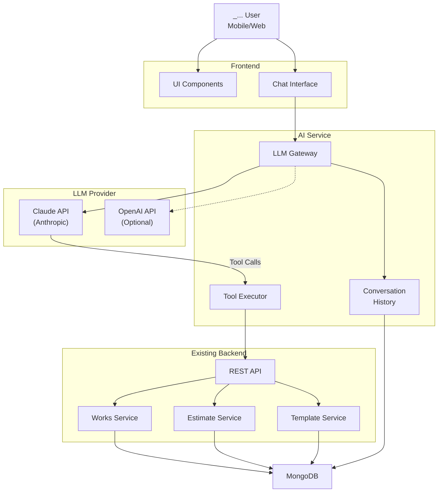
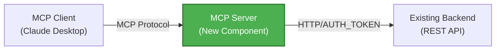
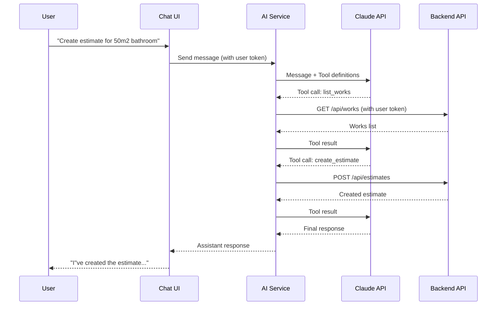
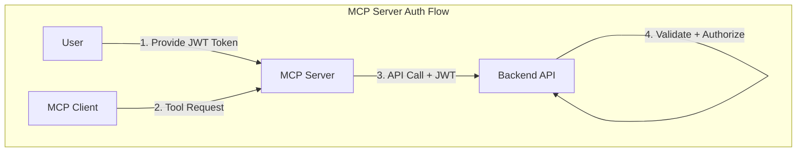
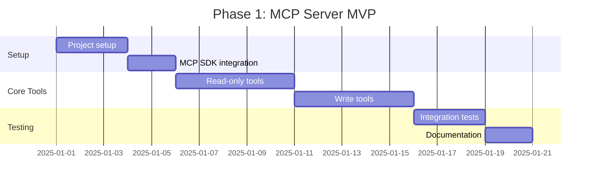

# LLM/Chatbot Integration Plan

This document outlines the strategy for integrating LLM capabilities into the Estimate Platform, enabling intelligent conversational features for users.

## Executive Summary

Add AI-powered assistant capabilities to help users:
- Generate estimates through natural language conversations
- Get intelligent recommendations based on their data
- Analyze costs and receive optimization suggestions
- Query their projects and materials using plain English

---

## Use Cases

### 1. Conversational Estimate Generation

**Scenario:** User describes a project in natural language, assistant creates the estimate.

```
User: "I need an estimate for renovating a 50m2 bathroom. Include tiling,
       painting, and plumbing work. The client is John Smith at 123 Main St."

Assistant: "I'll create that estimate for you. Based on your work catalog:
  - Tiling (50m2): Labor $1,250 + Materials $800 = $2,050
  - Painting (50m2): Labor $375 + Materials $262 = $637
  - Plumbing fixtures: Labor $500 + Materials $1,200 = $1,700
  
  Total: $4,387 (before discounts). Want me to apply your standard 5% material discount?"
```

**LLM Capabilities Needed:**
- Parse project description to extract work types and quantities
- Match to user's existing work definitions
- Calculate costs using stored pricing data
- Create estimate via API

---

### 2. Cost Analysis & Optimization

**Scenario:** User asks for help reducing project costs.

```
User: "This estimate is over budget. How can I reduce costs?"

Assistant: "Looking at your estimate for John Smith's bathroom:
  
  1. Materials ($2,262): Your tiles are premium grade. Standard tiles would save ~30%.
  2. Labor discount: Currently 0%. A 10% discount saves $212.
  3. Scope: Removing ceiling painting saves $150.
  
  Potential savings: up to $800 (18%). Want me to create an alternative estimate?"
```

**LLM Capabilities Needed:**
- Access existing estimate data
- Compare material options and pricing
- Suggest alternatives based on work catalog
- Create modified estimates

---

### 3. Intelligent Queries

**Scenario:** User asks questions about their business data.

```
User: "What was my average bathroom renovation cost this year?"

Assistant: "Based on your 12 bathroom estimates in 2024:
  - Average total: $5,234
  - Range: $3,800 - $8,450
  - Average labor: $2,100 (40%)
  - Average materials: $3,134 (60%)
  - Most common works: Tiling (100%), Painting (92%), Plumbing (75%)"
```

```
User: "How much paint do I need for a 100m2 room?"

Assistant: "Based on your 'Interior Painting' work definition:
  - Paint consumption: 0.15L per m2
  - For 100m2: 15L of paint needed
  - Primer consumption: 0.1L per m2
  - For 100m2: 10L of primer needed
  - Estimated material cost: $625"
```

**LLM Capabilities Needed:**
- Aggregate and analyze historical estimates
- Access work and material definitions
- Perform calculations based on consumption rates

---

### 4. Template Recommendations

**Scenario:** User needs help selecting appropriate templates.

```
User: "What should I include for a kitchen renovation?"

Assistant: "Based on your templates and past estimates, kitchen renovations typically include:
  
  From your 'Kitchen Basic' template:
  - Cabinet installation
  - Countertop installation
  - Painting
  
  Often added:
  - Floor tiling (83% of kitchen projects)
  - Backsplash (67% of projects)
  - Lighting installation (50%)
  
  Want me to start an estimate with the 'Kitchen Basic' template?"
```

**LLM Capabilities Needed:**
- Access user's template library
- Analyze historical patterns in estimates
- Suggest relevant works based on project type

---

### 5. Project Status & Reminders

**Scenario:** User asks about pending work.

```
User: "What estimates are expiring soon?"

Assistant: "You have 3 estimates expiring in the next 7 days:
  
  1. John Smith - Bathroom ($4,387) - Expires: Dec 15
  2. Mary Johnson - Kitchen ($12,560) - Expires: Dec 17
  3. Acme Offices - Painting ($8,240) - Expires: Dec 18
  
  Want me to extend any of these?"
```

**LLM Capabilities Needed:**
- Query estimates by validity date
- Update estimate validity periods

---

### 6. Multi-User Collaboration (Future)

**Scenario:** Team members collaborate on estimates.

```
User (Admin): "Show me all estimates created by the team this month."

Assistant: "Team estimates for December 2024:
  
  By user:
  - John (12 estimates, $45,200 total)
  - Sarah (8 estimates, $32,100 total)
  - Mike (5 estimates, $18,000 total)
  
  Total pipeline: $95,300"
```

**LLM Capabilities Needed:**
- Access team-wide data (with proper authorization)
- Aggregate metrics across users

---

## Architecture Overview



---

## Implementation Approaches

### Option A: MCP (Model Context Protocol) Server - Recommended

Expose your API as an MCP server, allowing any MCP-compatible LLM client to securely access your data.

**Pros:**
- Standardized protocol (Anthropic's MCP)
- Works with Claude Desktop, Claude Code, and other MCP clients
- Clean separation between LLM and data access
- User controls what data the LLM can access
- No LLM costs on your end (user brings their own)

**Cons:**
- Requires user to set up MCP client
- Less integrated UI experience

---

### Option B: Embedded AI Assistant (Built-in Chatbot)

Build an AI assistant directly into your application UI.

**Pros:**
- Seamless user experience
- Full control over capabilities
- Can enforce business rules and limits
- Consistent behavior across all users

**Cons:**
- LLM API costs on your end
- More complex to implement
- Need to handle rate limiting, usage tracking

---

### Option C: Hybrid Approach (Recommended for Full Product)

Implement both MCP server and embedded assistant, sharing the same tool definitions.

**Pros:**
- Maximum flexibility
- Users can choose their preferred interface
- Power users can use MCP for advanced workflows
- Casual users get simple in-app experience

**Cons:**
- More development effort
- Two systems to maintain

---

## Detailed Implementation Plan

### Phase 1: MCP Server Implementation

**Objective:** Expose estimate data via MCP protocol.



#### Tasks:

1. **Create MCP Server Project**
   ```bash
   # New typescript/node project
   estimate-mcp-server/
     src/
       index.ts            # MCP server entry point
       tools/              # Tool definitions
         works.ts          # Work CRUD tools
         templates.ts      # Template tools
         estimates.ts      # Estimate tools
         analytics.ts      # Analytics/query tools
       api-client.ts       # HTTP client for backend
       auth.ts             # Authentication handling
   ```

2. **Define MCP Tools**
   
   | Tool Name | Description | Parameters |
   |-----------|-------------|------------|
   | `list_works` | Get all work definitions | `search?: string` |
   | `get_work` | Get single work details | `work_id: string` |
   | `create_work` | Create new work type | `name, unit, materials` |
   | `list_templates` | Get all templates | `search?: string` |
   | `get_template` | Get template with works | `template_id: string` |
   | `list_estimates` | Get all estimates | `filter?: status/date` |
   | `get_estimate` | Get estimate details | `estimate_id: string` |
   | `create_estimate` | Create new estimate | `investor, work_items, etc.` |
   | `update_estimate` | Modify estimate | `estimate_id, changes` |
   | `calculate_materials` | Calculate materials for quantity | `work_id, quantity` |
   | `analyze_estimates` | Get statistics/summaries | `date_range?, type?` |
   | `find_expiring_estimates` | Get soon-to-expire | `days: number` |

3. **Implement Authentication**
   - User provides JWT/API token to MCP server
   - MCP server includes token in all backend requests
   - Backend enforces existing authorization rules

4. **Example Tool Definition**

   ```typescript
   // src/tools/estimates.ts
   export const createEstimateTool = {
     name: "create_estimate",
     description: "Create a new cost estimate for a renovation project",
     inputSchema: {
       type: "object",
       properties: {
         investorName: {
           type: "string",
           description: "Client/investor name"
         },
         investorAddress: {
           type: "string",
           description: "Project location/address"
         },
         templateIds: {
           type: "array",
           items: { type: "string" },
           description: "Template IDs to include"
         },
         workItems: { 
           type: "array",
           description: "Work items with quantities and pricing"
         },
         materialDiscount: {
           type: "number",
           description: "Percentage discount on materials (0-100)"
         },
         laborDiscount: {
           type: "number",
           description: "Percentage discount on labor (0-100)"
         },
         validUntil: {
           type: "string",
           description: "Quote expiration date (YYYY-MM-DD)"
         },
         startDate: {
           type: "string",
           description: "Project start date (YYYY-MM-DD)"
         },
         notes: {
           type: "string",
           description: "Additional notes or comments"
         }
       },
       required: ["investorName", "investorAddress", "workItems"]
     }
   };
   ```

5. **User Setup Instructions**
   ```bash
   # Install the MCP server globally
   npm install -g estimate-mcp-server
   
   # Configure with API token
   estimate-mcp config --token "your-jwt-token" --api-url "https://api.estimate.com"
   
   # Add to Claude Desktop config
   ```

---

### Phase 2: Backend API Enhancements

**Objective:** Add endpoints needed for LLM integration.

#### New Endpoints:

```yaml
# Analytics endpoints
GET  /api/analytics/estimates/summary?from=&amp;to=
GET  /api/analytics/estimates/by-template
GET  /api/analytics/works/most-used
GET  /api/analytics/costs/average

# Utility endpoints
GET  /api/estimates/expiring?days=7
POST /api/estimates/{id}/extend
GET  /api/works/{id}/calculate?quantity=100

# Search endpoints
GET  /api/works/search?q=painting
GET  /api/templates/search?q=bathroom
GET  /api/estimates/search?q=smith
```

#### Tasks:

1. **Create Analytics Ports & Use Cases**
   ```java
   // domain/port/in/GetEstimateAnalyticsUseCase.java
   public interface GetEstimateAnalyticsUseCase {
       Mono<EstimateSummary> getSummary(String userId, LocalDate from, LocalDate to);
       Flux<TemplateUsage> getUsageByTemplate(String userId);
       Mono<AverageCosts> getAverageCosts(String userId, String templateId);
   }
   ```

2. **Add Search Capabilities**
   ```java
   // domain/port/out/WorkRepositoryPort.java
   Flux<Work> searchByName(String userId, String query);
   
   // domain/port/out/EstimateRepositoryPort.java
   Flux<Estimate> searchByInvestor(String userId, String query);
   Flux<Estimate> findExpiringBefore(String userId, LocalDate date);
   ```

3. **Add Calculation Endpoints**
   ```java
   // adapter/in/web/work/WorkController.java
   @GetMapping("/{id}/calculate")
   public Mono<MaterialCalculationResponse> calculateMaterials(
       @PathVariable String id,
       @RequestParam BigDecimal quantity) {
       // Returns material quantities and estimated costs
   }
   ```

---

### Phase 3: Embedded AI Assistant (Optional)

**Objective:** Add in-app chatbot for seamless UX.

#### Architecture:



#### Tasks:

1. **Create AI Service**
   ```java
   // New module: adapter/in/web/ai/AiAssistantController.java
   @PostMapping("/api/ai/chat")
   public Flux<ChatResponse> chat(@RequestBody ChatRequest request) {
       // Stream responses via SSE
   }
   ```

2. **Implement Tool Executor**
   ```java
   // infrastructure/ai/ToolExecutor.java
   public class ToolExecutor {
       private final WorkService workService;
       private final EstimateService estimateService;
       private final TemplateService templateService;
       
       public Mono<String> execute(String toolName, Map<String, Object> params) {
           return switch (toolName) {
               case "list_works" -> workService.listAll().map(this::toJson);
               case "create_estimate" -> estimateService.create(params).map(this::toJson);
               // ... other tools
           };
       }
   }
   ```

3. **Add Conversation History**
   ```java
   // domain/model/Conversation.java
   public class Conversation {
       private String id;
       private String userId;
       private List<Message> messages;
       private Instant createdAt;
       private Instant updatedAt;
   }
   ```

4. **Frontend Chat Component**
   - Floating chat widget
   - Message history
   - Streaming responses
   - Quick action buttons

---

## Security Considerations

### Authentication & Authorization



#### Principles:

1. **User Token Forwarding**
   - MCP server never stores credentials long-term
   - Each request includes user's JWT
   - Backend enforces all authorization

2. **Scoped Access**
   - LLM only accesses data the user owns
   - No cross-user data leakage possible
   - Existing backend security rules apply

3. **Rate Limiting**
   - MCP server rate limits per user
   - Prevents abuse of LLM and backend resources

4. **Audit Logging**
   - All tool calls logged with user context
   - Data access patterns trackable

### Data Privacy

1. **No Data Sent to LLM Unnecessarily**
   - Only queried data sent in tool results
   - No bulk data exports

2. **User Control**
   - Users can revoke MCP access anytime
   - Clear visibility into what data LLM accesses

3. **Data Retention**
   - Conversation history optional
   - Users can delete conversations

---

## Technology Choices

### LLM Provider

| Provider | Pros | Cons |
|----------|------|------|
| **Claude (Anthropic)** | Excellent tool use, MCP native | Slightly higher cost |
| OpenAI GPT-4o | Wide adoption, good tool use | No MCP support |
| Google Gemini | GCP integration | Less mature tool use |

**Recommendation:** Claude for MCP compatibility and superior tool use.

### MCP Server Technology

- **Language:** TypeScript/Node.js (official SDK support)
- **Alternative:** Python (good SDK support)
- **Java:** Community SDK available but less mature

---

## Cost Estimation

### LLM API Costs (Embedded Assistant Only)

| Usage Level | Monthly Messages | Est. Tokens | Cost (Claude) |
|-------------|------------------|-------------|---------------|
| Light | 1,000 | 500K | ~$5 |
| Medium | 5,000 | 2.5M | ~$25 |
| Heavy | 20,000 | 10M | ~$100 |

### Infrastructure Costs

| Component | Monthly Cost |
|-----------|--------------|
| MCP Server (Cloud Run) | $5-20 |
| AI Service (Cloud Run) | $10-30 |
| Conversation Storage | $1-5 |

---

## Implementation Roadmap

### Phase 1: MCP Server (MVP)



**Deliverables:**
- Working MCP server with core tools
- Connects to existing backend API
- Usable with Claude Desktop

### Phase 2: Backend Enhancements

**Deliverables:**
- Analytics endpoints
- Search capabilities
- Calculation endpoints

### Phase 3: Embedded Assistant (Optional)

**Deliverables:**
- AI service with Claude integration
- Chat UI component
- Conversation history

---

## Success Metrics

| Metric | Target |
|--------|--------|
| MCP tool response time | < 500ms |
| Estimate creation via chat | < 30s |
| User satisfaction | > 4/5 rating |
| Chat adoption rate | > 30% of users |
| Error rate | < 1% |

---

## Appendix: MCP Tool Specifications

### Complete Tool List

```yaml
tools:
    # Work Management
    - name: list_works
      description: Get all work definitions for the user
      params:
        - search: string (optional, filter by name)
    
    - name: get_work
      description: Get detailed information about a specific work
      params:
        - work_id: string (required)
    
    - name: create_work
      description: Create a new work type
      params:
        - name: string (required)
        - unit: string (required, e.g., "m2", "hour")
        - materials: array (optional)
    
    - name: update_work
      description: Update an existing work definition
      params:
        - work_id: string (required)
        - name: string (optional)
        - unit: string (optional)
        - materials: array (optional)
    
    - name: delete_work
      description: Delete a work definition
      params:
        - work_id: string (required)
    
    # Template Management
    - name: list_templates
      description: Get all renovation templates
      params:
        - search: string (optional)
    
    - name: get_template
      description: Get template with included works
      params:
        - template_id: string (required)
    
    - name: create_template
      description: Create a new renovation template
      params:
        - name: string (required)
        - work_ids: array (required)
    
    # Estimate Management
    - name: list_estimates
      description: Get all estimates with optional filters
      params:
        - search: string (optional, search by investor)
        - status: string (optional, "active" or "expired")
    
    - name: get_estimate
      description: Get detailed estimate information
      params:
        - estimate_id: string (required)
    
    - name: create_estimate
      description: Create a new cost estimate
      params:
        - investor_name: string (required)
        - investor_address: string (required)
        - template_ids: array (optional)
        - work_items: array (required)
        - material_discount: number (optional, 0-100)
        - labor_discount: number (optional, 0-100)
        - valid_until: string (optional, YYYY-MM-DD)
        - start_date: string (optional, YYYY-MM-DD)
        - notes: string (optional)
    
    - name: update_estimate
      description: Update an existing estimate
      params:
        - estimate_id: string (required)
        - ... (same as create, all optional)
    
    - name: delete_estimate
      description: Delete an estimate
      params:
        - estimate_id: string (required)
    
    # Analytics & Utilities
    - name: calculate_materials
      description: Calculate materials needed for a work
      params:
        - work_id: string (required)
        - quantity: number (required)
    
    - name: get_estimate_summary
      description: Get aggregated statistics for estimates
      params:
        - from_date: string (optional)
        - to_date: string (optional)
    
    - name: find_expiring_estimates
      description: Find estimates expiring soon
      params:
        - days: number (required, e.g., 7 for next week)
    
    - name: extend_estimate_validity
      description: Extend the validity period of an estimate
      params:
        - estimate_id: string (required)
        - new_valid_until: string (required, YYYY-MM-DD)
```

---

**Status:** Proposal
**Author:** AI Assistant
**Last Updated:** 2025-12-13