# API Reference

## API Overview


## Authentication

### Register
```http
POST /api/auth/register
Content-Type: application/json

{
  "email": "user@example.com",
  "password": "password123",
  "companyName": "My Company",
  "phone": "+48123456789"
}
```

### Login (JWT profile only)
```http
POST /api/auth/login
Content-Type: application/json

{
  "email": "user@example.com",
  "password": "password123"
}
```

**Response:**
```json
{
  "token": "eyJhbGciOiJIUzI1NiJ9...",
  "userId": "64f8a1b2c3d4e5f6a7b8c9d0",
  "email": "user@example.com",
  "role": "USER"
}
```

## Users

### Get Current User
```http
GET /api/users/me
Authorization: Bearer <token>
```

### Update Profile
```http
PUT /api/users/me
Authorization: Bearer <token>

{
  "companyName": "New Company Name",
  "phone": "+48987654321"
}
```

### Change Password
```http
PUT /api/users/me/password
Authorization: Bearer <token>

{
  "oldPassword": "current",
  "newPassword": "newpassword"
}
```

### Delete Account
```http
DELETE /api/users/me
Authorization: Bearer <token>
```

## Works

### List Works
```http
GET /api/works
Authorization: Bearer <token>
```

### Create Work
```http
POST /api/works
Authorization: Bearer <token>

{
  "name": "Painting",
  "unit": "m²",
  "laborCostPerUnit": 25.00,
  "materials": [
    {
      "name": "Paint",
      "unit": "l",
      "consumptionPerUnit": 0.15,
      "pricePerUnit": 35.00
    }
  ]
}
```

### Get/Update/Delete Work
```http
GET    /api/works/{id}
PUT    /api/works/{id}
DELETE /api/works/{id}
```

## Templates

### List Templates
```http
GET /api/templates
Authorization: Bearer <token>
```

### Create Template
```http
POST /api/templates
Authorization: Bearer <token>

{
  "name": "Bathroom Renovation",
  "description": "Complete bathroom renovation",
  "workItems": [
    {
      "workId": "64f8a1b2c3d4e5f6a7b8c9d0",
      "quantity": 15.0
    }
  ]
}
```

## Estimates

### List Estimates
```http
GET /api/estimates
Authorization: Bearer <token>
```

### Create Estimate
```http
POST /api/estimates
Authorization: Bearer <token>

{
  "investorName": "John Doe",
  "investorAddress": "123 Main St",
  "projectAddress": "456 Oak Ave",
  "templateItems": [
    {
      "templateId": "64f8a1b2c3d4e5f6a7b8c9d0",
      "quantity": 1
    }
  ],
  "materialDiscount": 5.0,
  "laborDiscount": 10.0,
  "notes": "Additional notes",
  "validUntil": "2024-12-31",
  "startDate": "2024-01-15"
}
```

## Admin Endpoints (ADMIN role required)

```http
GET    /api/admin/users
DELETE /api/admin/users/{id}
GET    /api/admin/works
GET    /api/admin/templates
GET    /api/admin/estimates
```

## Error Responses

```json
{
  "status": 400,
  "error": "Bad Request",
  "message": "Email already exists",
  "timestamp": "2024-01-15T10:30:00Z"
}
```

| Status | Description |
|--------|-------------|
| 400 | Invalid request |
| 401 | Unauthorized |
| 403 | Forbidden |
| 404 | Not found |
| 409 | Conflict |
| 423 | Account locked |

## Creating an Estimate - Complete Flow


## Data Model Relationships

```mermaid
graph TB
    User["👤 User<br/>─────<br/>id: UUID<br/>email<br/>password<br/>company<br/>phone<br/>role"]
    
    Work["🔨 Work<br/>─────<br/>id: UUID<br/>userId<br/>name<br/>unit<br/>laborCost"]
    
    Material["🛠️ Material<br/>─────<br/>id: UUID<br/>workId<br/>name<br/>unit<br/>pricePerUnit<br/>consumption"]
    
    Template["📋 Template<br/>─────<br/>id: UUID<br/>userId<br/>name<br/>works[]"]
    
    Estimate["💰 Estimate<br/>─────<br/>id: UUID<br/>userId<br/>templates[]<br/>investor<br/>address<br/>total<br/>discount"]
    
    User -->|owns| Work
    Work -->|contains| Material
    User -->|creates| Template
    Template -->|references| Work
    User -->|generates| Estimate
    Estimate -->|uses| Template
    
    style User fill:#9C27B0,stroke:#6a1b9a,stroke-width:2px,color:#fff
    style Work fill:#FF9800,stroke:#e65100,stroke-width:2px,color:#fff
    style Material fill:#FF6F00,stroke:#e65100,stroke-width:2px,color:#fff
    style Template fill:#3F51B5,stroke:#283593,stroke-width:2px,color:#fff
    style Estimate fill:#E91E63,stroke:#ad1457,stroke-width:2px,color:#fff
```


