# Multi-Provider Authentication Architecture

## Overview

The Estimate Backend supports two authentication providers that can be selected at deployment time using Spring Profiles:

1. **Custom JWT Authentication** (`jwt` profile) - Default
2. **GCP Identity Platform** (`gcp` profile) - Firebase Authentication

## Architecture Diagram - Clean Architecture Layers

```mermaid
graph TB
    subgraph Client["👤 CLIENT LAYER"]
        App["📱 Mobile App / Web Frontend"]
    end
    
    subgraph Web["🌐 WEB ADAPTER LAYER"]
        Controller["AuthController<br/>REST API<br/>POST /api/auth/register<br/>POST /api/auth/login"]
    end
    
    subgraph AppLayer["⚙️ APPLICATION LAYER"]
        RegisterUC["RegisterUserService<br/>Use Case"]
        LoginUC["LoginUserService<br/>Use Case"]
    end
    
    subgraph Domain["🔷 DOMAIN LAYER - Ports & Entities"]
        Port["🔌 AuthenticationProviderPort<br/>Interface<br/>────────────<br/>+ authenticate<br/>+ registerUser<br/>+ validateToken<br/>+ extractUserInfo<br/>+ managesPasswords"]
        User["👤 User<br/>Entity"]
        AuthResult["🎫 AuthenticationResult<br/>Value Object"]
    end
    
    subgraph Infra["🔧 INFRASTRUCTURE LAYER - Adapters"]
        JWT["🔐 JWT Provider<br/>@Profile jwt<br/>────────────<br/>• bcrypt hashing<br/>• JWT generation<br/>• Rate limiting<br/>• Account lockout"]
        GCP["🌍 GCP Provider<br/>@Profile gcp<br/>────────────<br/>• Firebase SDK<br/>• Token validation<br/>• User sync<br/>• Custom tokens"]
    end
    
    subgraph Persistence["💾 PERSISTENCE LAYER"]
        MongoDB["🗄️ MongoDB<br/>Business Data<br/>────────────<br/>• Users<br/>• Works<br/>• Templates<br/>• Estimates"]
        Firebase["🔑 Firebase Auth<br/>GCP Managed<br/>────────────<br/>• Users<br/>• Passwords<br/>• OAuth<br/>• MFA"]
    end
    
    Client --> Web
    Web --> AppLayer
    AppLayer --> Domain
    Domain --> Infra
    Infra --> Persistence
    
    RegisterUC --> Port
    LoginUC --> Port
    Port --> User
    Port --> AuthResult
    
    JWT --> MongoDB
    GCP --> Firebase
    GCP --> MongoDB
    
    style Client fill:#fff9c4,stroke:#f57f17,stroke-width:2px
    style Controller fill:#fff9c4,stroke:#f57f17,stroke-width:2px
    style RegisterUC fill:#e1f5fe,stroke:#01579b,stroke-width:2px
    style LoginUC fill:#e1f5fe,stroke:#01579b,stroke-width:2px
    style Port fill:#f3e5f5,stroke:#512da8,stroke-width:3px,color:#000
    style User fill:#f3e5f5,stroke:#512da8,stroke-width:2px
    style AuthResult fill:#f3e5f5,stroke:#512da8,stroke-width:2px
    style JWT fill:#2196F3,stroke:#1565c0,stroke-width:2px,color:#fff
    style GCP fill:#4CAF50,stroke:#2e7d32,stroke-width:2px,color:#fff
    style MongoDB fill:#e1f5fe,stroke:#01579b,stroke-width:2px
    style Firebase fill:#ff9800,stroke:#e65100,stroke-width:2px,color:#fff
```



## Sequence Diagrams

### 1. Registration Flow - JWT Profile

```
Client          AuthController    RegisterUserService    CustomJwtProvider    MongoDB
  │                   │                    │                     │                │
  │  POST /register   │                    │                     │                │
  ├──────────────────>│                    │                     │                │
  │                   │  register(cmd)     │                     │                │
  │                   ├───────────────────>│                     │                │
  │                   │                    │  registerUser()     │                │
  │                   │                    ├────────────────────>│                │
  │                   │                    │  check email exists │                │
  │                   │                    │────────────────────────────────────>│
  │                   │                    │                     │     false      │
  │                   │                    │<────────────────────────────────────│
  │                   │                    │  hash password      │                │
  │                   │                    │  create user        │                │
  │                   │                    │  save user          │                │
  │                   │                    │────────────────────────────────────>│
  │                   │                    │                     │      user      │
  │                   │                    │<────────────────────────────────────│
  │                   │                    │  generateToken()    │                │
  │                   │                    ├────────────────────>│                │
  │                   │                    │     JWT token       │                │
  │                   │                    │<────────────────────│                │
  │                   │  AuthResult        │                     │                │
  │                   │<───────────────────│                     │                │
  │   200 + JWT       │                    │                     │                │
  │<──────────────────│                    │                     │                │
```

### 2. Registration Flow - GCP Profile

```
Client          AuthController    RegisterUserService    GcpIdentityProvider    Firebase    MongoDB
  │                   │                    │                     │                  │            │
  │  POST /register   │                    │                     │                  │            │
  ├──────────────────>│                    │                     │                  │            │
  │                   │  register(cmd)     │                     │                  │            │
  │                   ├───────────────────>│                     │                  │            │
  │                   │                    │  registerUser()     │                  │            │
  │                   │                    ├────────────────────>│                  │            │
  │                   │                    │  createUser()       │                  │            │
  │                   │                    │────────────────────────────────────────>│            │
  │                   │                    │              UserRecord (UID)           │            │
  │                   │                    │<────────────────────────────────────────│            │
  │                   │                    │  save business data │                  │            │
  │                   │                    │───────────────────────────────────────────────────>│
  │                   │                    │                     │                  │    user    │
  │                   │                    │<───────────────────────────────────────────────────│
  │                   │                    │  createCustomToken()│                  │            │
  │                   │                    │────────────────────────────────────────>│            │
  │                   │                    │      custom token   │                  │            │
  │                   │                    │<────────────────────────────────────────│            │
  │                   │  AuthResult        │                     │                  │            │
  │                   │<───────────────────│                     │                  │            │
  │   200 + Token     │                    │                     │                  │            │
  │<──────────────────│                    │                     │                  │            │
```

### 3. Authentication Flow - JWT Profile

```
Client          JwtAuthFilter     CustomJwtProvider    MongoDB
  │                   │                    │               │
  │  GET /api/works   │                    │               │
  │  Bearer: JWT      │                    │               │
  ├──────────────────>│                    │               │
  │                   │  validateToken()   │               │
  │                   ├───────────────────>│               │
  │                   │     valid=true     │               │
  │                   │<───────────────────│               │
  │                   │  extractUserInfo() │               │
  │                   ├───────────────────>│               │
  │                   │   UserAuthInfo     │               │
  │                   │<───────────────────│               │
  │                   │  Set SecurityContext              │
  │                   │  Continue filter chain             │
  │                   ├──────────────────────────────────>│
  │   200 + data      │                    │               │
  │<──────────────────│                    │               │
```

### 4. Authentication Flow - GCP Profile

```
Client          GcpAuthFilter     GcpIdentityProvider    Firebase    MongoDB
  │                   │                    │                  │           │
  │  GET /api/works   │                    │                  │           │
  │  Bearer: IdToken  │                    │                  │           │
  ├──────────────────>│                    │                  │           │
  │                   │  validateToken()   │                  │           │
  │                   ├───────────────────>│                  │           │
  │                   │  verifyIdToken()   │                  │           │
  │                   │───────────────────────────────────────>│           │
  │                   │      valid=true    │                  │           │
  │                   │<───────────────────────────────────────│           │
  │                   │<───────────────────│                  │           │
  │                   │  extractUserInfo() │                  │           │
  │                   ├───────────────────>│                  │           │
  │                   │  decode token      │                  │           │
  │                   │  get user from DB  │                  │           │
  │                   │──────────────────────────────────────────────────>│
  │                   │                    │                  │   user    │
  │                   │<──────────────────────────────────────────────────│
  │                   │   UserAuthInfo     │                  │           │
  │                   │<───────────────────│                  │           │
  │                   │  Set SecurityContext                  │           │
  │                   │  Continue filter chain                │           │
  │                   ├──────────────────────────────────────────────────>│
  │   200 + data      │                    │                  │           │
  │<──────────────────│                    │                  │           │
```

## Component Details

### Domain Layer

**AuthenticationProviderPort** - Core abstraction for authentication:
- Defines contract for any authentication provider
- Independent of implementation details (JWT, OAuth, Firebase, etc.)
- Returns domain models (AuthenticationResult, UserAuthInfo)

**Key Domain Models:**
- `AuthenticationResult` - Contains token, user info, provider type
- `UserAuthInfo` - User identity extracted from token
- `RegisterUserData` - User registration payload
- `AuthProviderType` - Enum: CUSTOM_JWT, GCP_IDENTITY

### Infrastructure Layer - JWT Provider

**CustomJwtAuthenticationProvider**
- Implements `AuthenticationProviderPort`
- Manages passwords with bcrypt
- Generates and validates JWT tokens
- Implements rate limiting (5 failed attempts)
- Account lockout (15 minutes)
- Stores users in MongoDB

**JwtAuthenticationFilter**
- Extracts Bearer token from Authorization header
- Validates JWT signature and expiration
- Extracts user claims (id, email, role)
- Sets Spring Security context

**SecurityConfig**
- Configures HTTP security
- CORS settings
- Public endpoints: /api/auth/**, /actuator/health
- Protected endpoints: /api/**, /api/admin/** (ADMIN role)

### Infrastructure Layer - GCP Provider

**GcpIdentityAuthenticationProvider**
- Implements `AuthenticationProviderPort`
- Uses Firebase Admin SDK
- Creates users in Firebase
- Validates Firebase ID tokens
- Syncs user business data to MongoDB (lazy sync)
- Returns Firebase custom tokens

**FirebaseConfig**
- Initializes Firebase App
- Supports credentials file or default application credentials
- Creates FirebaseAuth bean

**GcpAuthenticationFilter**
- Extracts Bearer token (Firebase ID token)
- Validates with Firebase
- Extracts user info
- Syncs user to MongoDB if not exists
- Sets Spring Security context

**GcpSecurityConfig**
- Same security rules as JWT
- Different authentication filter

## Profile Selection

### Default Profile (JWT)

```properties
# application.properties
spring.profiles.active=jwt
```

### GCP Profile

```bash
# Environment variable
export SPRING_PROFILES_ACTIVE=gcp
export GCP_PROJECT_ID=your-project-id
export GOOGLE_APPLICATION_CREDENTIALS=/path/to/credentials.json
```

### Docker Deployment

```dockerfile
# Dockerfile
ENV SPRING_PROFILES_ACTIVE=jwt
```

```bash
# Override at runtime
docker run -e SPRING_PROFILES_ACTIVE=gcp \
           -e GCP_PROJECT_ID=your-project \
           -e GOOGLE_APPLICATION_CREDENTIALS=/credentials.json \
           -v /path/to/creds.json:/credentials.json:ro \
           estimate-backend
```

### Cloud Run Deployment

```bash
# JWT Authentication
gcloud run deploy estimate-backend \
  --image gcr.io/PROJECT_ID/estimate-backend \
  --set-env-vars="SPRING_PROFILES_ACTIVE=jwt,JWT_SECRET=your-secret"

# GCP Identity Platform
gcloud run deploy estimate-backend \
  --image gcr.io/PROJECT_ID/estimate-backend \
  --set-env-vars="SPRING_PROFILES_ACTIVE=gcp,GCP_PROJECT_ID=your-project"
```

## Key Design Decisions

### 1. Strategy Pattern vs Factory Pattern
**Decision:** Strategy Pattern with Spring Profiles
**Rationale:** 
- Deployment-time selection (not runtime)
- Clean separation of concerns
- No conditional logic in domain layer
- Spring's native profile support

### 2. Keep Business Data in MongoDB (GCP Profile)
**Decision:** Store company, phone in MongoDB; auth in Firebase
**Rationale:**
- MongoDB is single source of truth for business logic
- Firebase manages authentication only
- Lazy user sync on first token validation
- Consistent data access patterns

### 3. Return Provider-Native Tokens
**Decision:** JWT for jwt profile, Firebase tokens for gcp profile
**Rationale:**
- Better integration with provider ecosystem
- Clients can use provider SDKs directly
- No token translation overhead

### 4. Password Reset Strategy (Migration)
**Decision:** Force password reset when switching to GCP
**Rationale:**
- Simple and secure
- Cannot migrate bcrypt hashes to Firebase
- Clear migration path

### 5. Admin Operations in API (Not Provider Console)
**Decision:** Admin APIs sync to provider
**Rationale:**
- Consistent API regardless of provider
- Provider is implementation detail
- Can switch providers without frontend changes

## Security Considerations

### JWT Profile
- Tokens signed with HS256 (HMAC-SHA256)
- Secret key stored in environment variable
- 24-hour token expiration
- Rate limiting: 5 failed attempts → 15 min lockout
- Passwords hashed with bcrypt

### GCP Profile
- Firebase manages all authentication
- Tokens validated against Google's public keys
- MFA supported by Firebase
- Password policy enforced by Firebase
- Account recovery through Firebase

## Testing Strategy

### Unit Tests
- Mock `AuthenticationProviderPort`
- Test use cases independently of provider

### Integration Tests
- `@ActiveProfiles("jwt")` - Test JWT flow
- `@ActiveProfiles("gcp")` - Test with Firebase emulator
- Same test scenarios for both profiles

### Contract Tests
- Ensure both providers implement same behavior
- Verify AuthenticationProviderPort contract

## Migration Guide

### From JWT to GCP

1. **Setup Firebase Project**
```bash
# Create Firebase project in GCP Console
# Enable Authentication with Email/Password provider
```

2. **Deploy with GCP Profile**
```bash
gcloud run deploy estimate-backend \
  --set-env-vars="SPRING_PROFILES_ACTIVE=gcp,GCP_PROJECT_ID=your-project"
```

3. **User Migration**
- Users must reset passwords (cannot migrate bcrypt hashes)
- Send password reset emails
- Or: Implement gradual migration on login

4. **Update Frontend**
- Use Firebase Client SDK for authentication
- Send Firebase ID token to backend
- Update login/register flows

### From GCP to JWT

1. **Export User Data**
```bash
# Export users from Firebase
gcloud firestore export gs://your-bucket/users
```

2. **Import to MongoDB**
```javascript
// Migrate users to MongoDB with temporary passwords
// Send password reset emails
```

3. **Deploy with JWT Profile**
```bash
gcloud run deploy estimate-backend \
  --set-env-vars="SPRING_PROFILES_ACTIVE=jwt,JWT_SECRET=your-secret"
```

## Performance Considerations

### JWT Profile
- ✅ Stateless token validation
- ✅ No external API calls
- ✅ Fast local verification
- ⚠️ Token size: ~500 bytes

### GCP Profile
- ⚠️ External API call for first validation
- ✅ Token caching with public key rotation
- ✅ Firebase global CDN
- ⚠️ Network latency: ~50-100ms

## Monitoring & Observability

### Metrics to Track
- Authentication success/failure rate
- Token validation latency
- Provider API call count (GCP)
- User sync operations (GCP)
- Account lockouts (JWT)

### Logging
```java
@Slf4j
log.info("User logged in: {}", email);
log.warn("Account locked: {}", email);
log.error("Firebase validation failed", exception);
```

### Health Checks
```bash
# Check active profile
GET /actuator/info

# Response includes:
{
  "app": {
    "auth": {
      "provider": "jwt",  // or "gcp"
      "managesPasswords": true
    }
  }
}
```
