# Authentication Architecture

## Overview

Two authentication providers, selected via Spring Profile:

| Profile | Provider | Best For |
|---------|----------|----------|
| `jwt` (default) | Custom JWT | Development, testing |
| `gcp` | Firebase/GCP Identity Platform | Production on GCP |

## Switching Providers

```bash
# Environment variable
export SPRING_PROFILES_ACTIVE=jwt  # or gcp

# Maven
./mvnw spring-boot:run -Dspring-boot.run.profiles=gcp

# Docker
docker run -e SPRING_PROFILES_ACTIVE=gcp estimate-backend
```

## Architecture Layers

```mermaid
graph TB
    subgraph Client["👤 CLIENT LAYER"]
        App["📱 Mobile/Web App"]
    end
    
    subgraph Web["🌐 WEB ADAPTER LAYER"]
        Controller["AuthController<br/>POST /auth/register<br/>POST /auth/login"]
    end
    
    subgraph App["⚙️ APPLICATION LAYER"]
        RegisterService["RegisterUserService"]
        LoginService["LoginUserService"]
    end
    
    subgraph Domain["🔷 DOMAIN LAYER"]
        Port["AuthenticationProviderPort<br/>📌 Interface/Port<br/>- authenticate<br/>- registerUser<br/>- validateToken"]
    end
    
    subgraph Infra["🔧 INFRASTRUCTURE LAYER"]
        JWT["🔐 JWT Provider<br/>@Profile(jwt)<br/>- bcrypt password hashing<br/>- JWT generation<br/>- Rate limiting"]
        GCP["🌍 GCP Provider<br/>@Profile(gcp)<br/>- Firebase SDK<br/>- User sync<br/>- Custom tokens"]
    end
    
    subgraph Persistence["💾 PERSISTENCE LAYER"]
        AuthDB["🗄️ MongoDB<br/>(Business Data)"]
        Firebase["🔑 Firebase<br/>(Auth Data)"]
    end
    
    App --> JWT
    App --> GCP
    
    Client --> Web
    Web --> App
    App --> Domain
    Domain --> Infra
    
    JWT --> AuthDB
    GCP --> Firebase
    GCP --> AuthDB
    
    style Client fill:#fff9c4,stroke:#f57f17,stroke-width:2px
    style Controller fill:#fff9c4,stroke:#f57f17,stroke-width:2px
    style RegisterService fill:#e1f5fe,stroke:#01579b,stroke-width:2px
    style LoginService fill:#e1f5fe,stroke:#01579b,stroke-width:2px
    style Port fill:#f3e5f5,stroke:#512da8,stroke-width:3px
    style JWT fill:#2196F3,stroke:#1565c0,stroke-width:2px,color:#fff
    style GCP fill:#4CAF50,stroke:#2e7d32,stroke-width:2px,color:#fff
    style AuthDB fill:#e1f5fe,stroke:#01579b,stroke-width:2px
    style Firebase fill:#ff9800,stroke:#e65100,stroke-width:2px,color:#fff
```



## Provider Selection

```mermaid
graph LR
    Env["📦 Environment"]
    
    Active["SPRING_PROFILES_ACTIVE"]
    
    JWT["JWT Profile<br/>jwt"]
    GCP["GCP Profile<br/>gcp"]
    
    JwtImpl["CustomJwtAuthenticationProvider<br/>@Profile(jwt)"]
    GcpImpl["GcpIdentityAuthenticationProvider<br/>@Profile(gcp)"]
    
    Env --> Active
    
    Active -->|jwt| JWT
    Active -->|gcp| GCP
    
    JWT --> JwtImpl
    GCP --> GcpImpl
    
    style JWT fill:#2196F3,stroke:#1565c0,stroke-width:2px,color:#fff
    style GCP fill:#4CAF50,stroke:#2e7d32,stroke-width:2px,color:#fff
    style JwtImpl fill:#2196F3,stroke:#1565c0,stroke-width:2px,color:#fff
    style GcpImpl fill:#4CAF50,stroke:#2e7d32,stroke-width:2px,color:#fff
```



## JWT Profile Features & Flow

**Features:**
- ✅ Password hashing with bcrypt
- ✅ Rate limiting: 5 failed attempts → 15 min lockout
- ✅ Token expiration: 24 hours
- ✅ Stateless validation
- ✅ No external dependencies
- ✅ Ideal for development & testing

**Registration Flow - JWT:**


**Login Flow - JWT:**


**Token Validation - JWT:**


## GCP Profile Features & Flow

**Features:**
- ✅ Firebase Authentication (GCP managed)
- ✅ MFA support (built-in)
- ✅ OAuth providers (Google, Facebook, GitHub)
- ✅ Password recovery (Firebase console)
- ✅ User data synced to MongoDB
- ✅ Ideal for production on GCP
- ✅ No password management overhead

**Registration Flow - GCP:**


**Token Validation - GCP:**


## Provider Comparison

```mermaid
graph TB
    subgraph JWT["🔐 JWT Profile (Custom)"]
        JwtFeatures["<b>Features:</b><br/>✅ Stateless<br/>✅ No dependency<br/>✅ Fast validation<br/>✅ Simple deployment<br/>⚠️ Manual password mgmt<br/>⚠️ No MFA"]
        JwtStack["<b>Stack:</b><br/>MongoDB (users)<br/>bcrypt (password)<br/>HS256 (signing)<br/>Spring Security"]
        JwtUse["<b>Best For:</b><br/>📌 Development<br/>📌 Testing<br/>📌 Small teams<br/>📌 Custom auth needs"]
    end
    
    subgraph GCP["🌍 GCP Profile (Firebase)"]
        GcpFeatures["<b>Features:</b><br/>✅ MFA support<br/>✅ OAuth providers<br/>✅ No password mgmt<br/>✅ Production grade<br/>✅ Rate limiting built-in<br/>✅ Account recovery"]
        GcpStack["<b>Stack:</b><br/>Firebase Auth<br/>MongoDB (profiles)<br/>GCP managed keys<br/>Spring Security"]
        GcpUse["<b>Best For:</b><br/>📌 Production on GCP<br/>📌 Enterprise needs<br/>📌 Large scale<br/>📌 OAuth/SSO"]
    end
    
    style JWT fill:#2196F3,stroke:#1565c0,stroke-width:2px,color:#fff
    style GCP fill:#4CAF50,stroke:#2e7d32,stroke-width:2px,color:#fff
    style JwtFeatures fill:#1976D2,stroke:#1565c0,stroke-width:1px,color:#fff
    style JwtStack fill:#1565c0,stroke:#0d47a1,stroke-width:1px,color:#fff
    style JwtUse fill:#2196F3,stroke:#1565c0,stroke-width:1px,color:#fff
    style GcpFeatures fill:#388E3C,stroke:#2e7d32,stroke-width:1px,color:#fff
    style GcpStack fill:#2e7d32,stroke:#1b5e20,stroke-width:1px,color:#fff
    style GcpUse fill:#4CAF50,stroke:#2e7d32,stroke-width:1px,color:#fff
```



## GCP Profile Setup

1. **Create Firebase project in GCP Console**
2. **Enable Email/Password authentication**
3. **Set environment variables:**

```bash
export SPRING_PROFILES_ACTIVE=gcp
export GCP_PROJECT_ID=your-project-id
export GOOGLE_APPLICATION_CREDENTIALS=/path/to/service-account.json
```

4. **Deploy to Cloud Run with credentials**

## Migration

**JWT → GCP:** Users must reset passwords (bcrypt hashes cannot migrate to Firebase)

**GCP → JWT:** Export users from Firebase, import to MongoDB with temporary passwords

## Configuration Files

- `application.properties` - Common settings, defaults to jwt profile
- `application-jwt.yml` - JWT-specific settings
- `application-gcp.yml` - GCP-specific settings

## Security

Both profiles:
- Bearer token authentication
- CORS configuration
- CSRF disabled (stateless API)
- Role-based access (USER, ADMIN)
